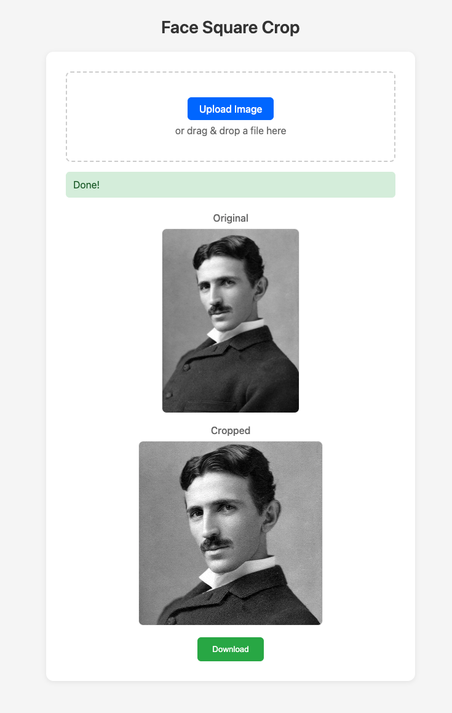

# Face-Centered Square Crop

Crop portrait photos to square images centered on the detected face.

## Why This?

When creating profile pictures, social media posts, or avatar images, you need a perfectly square crop. The challenge is ensuring the subject's face stays centered and visible—not cut off at the edge.

This tool automatically detects the face and crops to a square focused on it. This ensures:
- ✅ Face is always centered in the frame
- ✅ No awkward head cut-offs
- ✅ Perfect square aspect ratio every time
- ✅ Works with any portrait orientation



## Requirements

- macOS (Apple Silicon M1/M2/M3)
- [uv](https://github.com/astral-sh/uv) package manager

Install uv if you haven't:
```bash
curl -LsSf https://astral.sh/uv/install.sh | sh
```

## Installation

```bash
./install.sh
```

## Usage

```bash
./run.sh <input_image>
```

### Single Image

```bash
./run.sh photo.jpg
./run.sh portrait.png
./run.sh ~/Pictures/selfie.jpeg
```

### Batch Mode (Folder)

Process all images in a folder:

```bash
./run.sh --folder ./photos
./run.sh -f ./photos
```

With custom output directory:

```bash
./run.sh --folder ./photos --output ./cropped
./run.sh -f ./photos -o ./cropped
```

### Output

The cropped image is saved with `-square` appended to the filename:

| Input | Output |
|-------|--------|
| `photo.jpg` | `photo-square.jpg` |
| `IMG_123.PNG` | `IMG_123-square.PNG` |

## Error Handling

- **No face detected**: Exits with error code 1 and prints message
- **File not found**: Exits with error code 1

## How It Works

1. Detects face using OpenCV Haar Cascade
2. Calculates face center point (the "square focus point")
3. Creates square crop sized to the larger dimension
4. Centers square on face, clamped to image bounds
5. Saves with original format preserved

## Tags

face-detection, image-processing, opencv, python, square-crop, portrait, avatar-generator, photo-tools, computer-vision, macos
